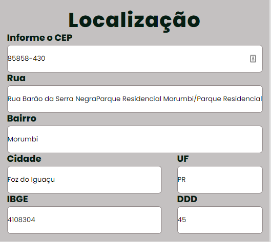

# Lading Page

Projeto com intuito de aprender html, css e js.
(https://guifranchin.github.io/cep-api/)

## Veja o desenvolvimento do projeto:

## 🤝 Contribuição

Projeto aberto para ajuda!

Lembre de seguir os requisitos da licensa...

## 🔖 Licensa

## 💰 Donate
PIX: a4eabcdd-1899-48cc-b751-bfd8bb92e96e (chave aleatoria)

## 😎 Como rodar

 `git clone https://github.com/guifranchin/ladingpage.git`
- Abra o arquivo index.html

Copyright © 2022 Guilherme Franchin

